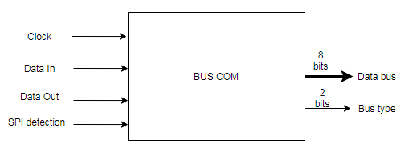

# 08_BUS_COM
Repository bus de communication

/!\ __La documentation est suception de changer au cours du travail de recherche__ /!\

**Tous les code on été testé sur Lattice Diamond software version (64-bit) 3.11.3.469**
**Carte de développement : LFXP2-5E Brevia 2**

La communication avec le bus de communication se décompose en 2 partie :
- Lecture du bus
- Ecriture sur le bus

## Lecture du bus de communication
### Entrées / Sorties
Pour faire la distinction entre les protocoles, les pins seront au nombre de **4** et **labélisés** :
- Clock
- Data IN
- Data OUT
- SS (Slave Select)

En fonction de ce qui est câblé, il est aisément possible de connaître le protocole utilisé. La démarche utilisée en VHDL est celle de ***pull down*** pour pouvoir détecter une tension lors du câblge.

Entrées | PIN  | Description
--------|------|-------------
Clock   |      | SCLK(SPI) CLK(I2C)
Data In |      | MOSI(SPI) SDA(I2C) Rx(UART)
Data Out|      |MISO(SPI) Tx(UART)
SPI detection | | SS (SPI)

Sorties|PIN|Description
-------|---|-----------
Data bus|   |Information du bus sur 8 bits
Bus type|   |Type de bus :  01 : SPI   10 : I2C   11 : UART

### Code de détection de pins
Un code permettant de connaître les pins câblés a été écrit. Comme expliqué précédemment, ces derniers étant **labélisés** si une tention est détectée, c'est qu'il sont reliés à quelque chose (autre que la masse). Cette détection n'est pas faite à un instant *t* car un signal peut varier au cours du temps (pour un câble mal branché par exemple). La méthode retenue est celle utilisant un **registre de comptage pour chaque pin**. Le programme lit la valeur des pins (0 ou 1) pendant **500 ms toutes les 500 ms** et **l'ajoute à un registre propre à chaque pin**. Si au bout de 500 ms la valeur d'un registre est différente de 0, c'est que le pin lié à ce registre a été câblé.
En fonction de la combinaison de registre différent de 0, il est possible de **connaître la configuration branchée**.

Code test_pin.vhd :
#### Entrées/sorties du code
Ports|Description
------|----------
Clock_50M (IN)|Signal logique simple. Horloge principale du FPGA
pins (IN)|Vecteur logique de 4 bits (correspondant aux entrées/sortie physique du FPGA)
leds (OUT)|Vecteur logique de 6 bits   4 pour observer les pin détectés   2 pour la configuration obtenue (SPI, I2C, UART)

#### Signaux internes
Nom|Description
---|-----------
Clock_2M|Signal logique simple. Sortie d'un component pour obtenir une horloge de 2 MHz
regc|Vecteur logique de 32 bits. Registre de compatage de front montant de l'horloge de 2 MHZ
reg1, reg2, reg3, reg4|Vecteur de 32 bits. Registre de comptage des valeurs des pins. Respectivement Clock, Data IN, Data OUT, SS.
pin_layout|Vecteur logique de 4 bits. Signal permettant de manipuler les leds pour visualiser les pins détectés
config|Vecteur logique de 2 bits. Signal récupérant la configuration utilisée (en fonction des pins détectés)

## Ecriture sur le bus de communication
Pour réaliser cette partie de façon optimisée, il faut indiquer quelles informations seront attendues. Tous les groupes du porjet attendent en réception des trames par paquet de **8 bits** (1 octet).
Voici la trame attendue pour l'écriture sur le bus :

Octet | Nom  | Description
-----|------|-------------
1|Nb_Octets|Nombre d’octets de la trame
2|ID_Sys|Système dont la commande est sollicité
3|ID_Cmd|Commande sollicité
4|Bus_type|Type de bus utilisé :  0x1 : SPI   0x2 : I2C   0x3 : UART
5|Adresse|Adresse de l'esclave (pour I2C)
6|Taille_mot|Taille du mot seul à transmettre en octet (hors spécification de taille ou fréquence)
7|Operateur|Nature de l'opérateur du facteur de bauds. _Exemple : 0 pour multiplication ; 1 pour division_
8|Facteur_baud|Facteur (multiple de 9 600) du baud rate de transmission. **Dans le cas où Operateur = 0, la valeur de Facteur_baud multiplie 9 600. Dans le cas où Operateur = 1, la valeur de Facteur_baud divise 9 600.**  _Exemple :   Operateur = 1; Facteur_baud = 0x20 (32) ==> Bauds = 300   Operateur = 0; Facteur_baud = 0x68 (104) ==> Bauds = 998 400_
9 ou plus|Mot|Mot à transmettre (dépend de Taille_mot)
